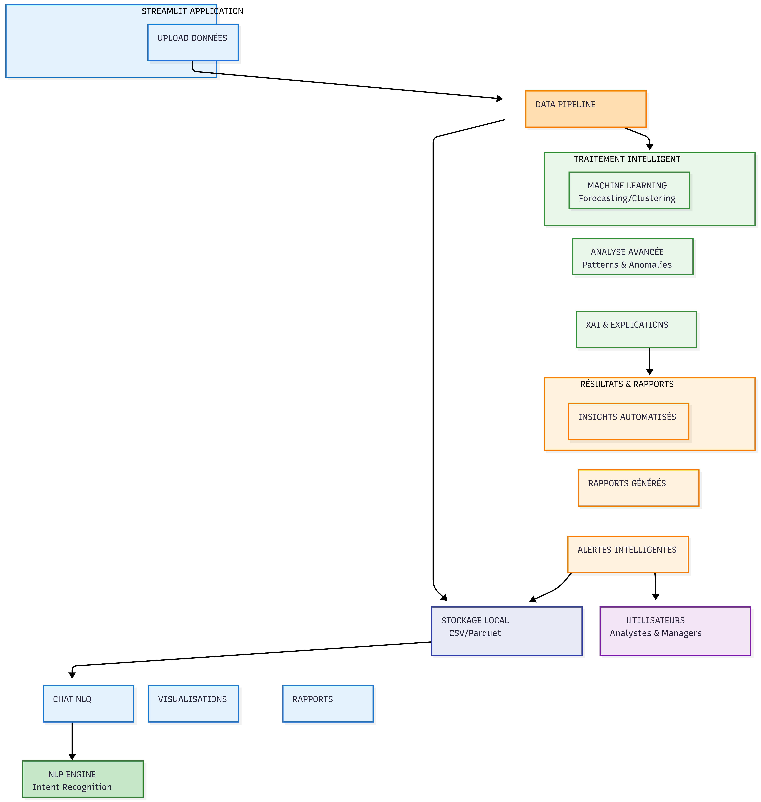
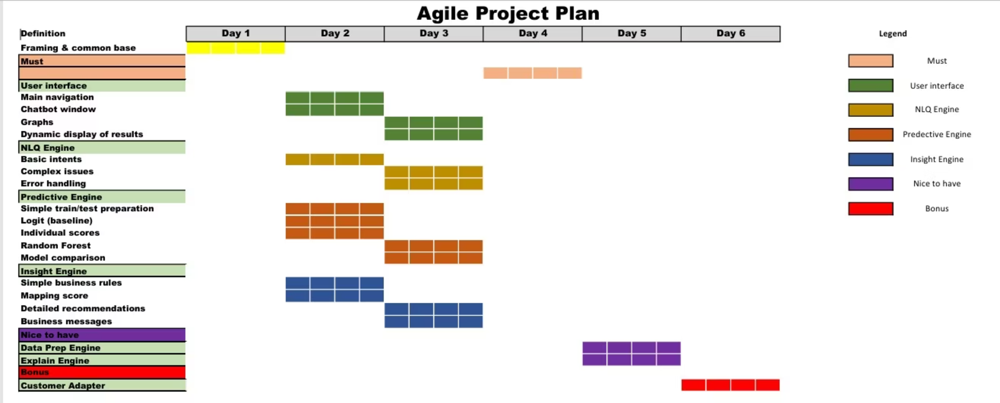
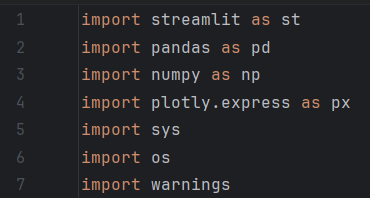
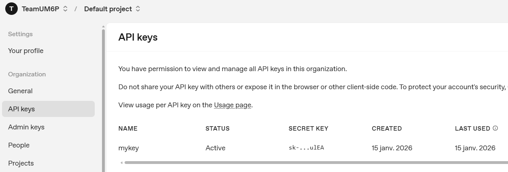

# INTELLIGENT ANALYTICS HACKATHON - 2026

**_Team UM6P_**

Ibrahima FARO [[ibrahima.faro@um6p.ma](mailto:ibrahima.faro@um6p.ma)],

Aya ALAMI [[aya.alami@um6p.ma](mailto:aya.alami@um6p.ma)],

Mariam DIAKITE [[mariam.diakite@um6p.ma](mailto:mariam.diakite@um6p.ma)],

Babacar Sanding [[babacar.sanding@um6p.ma](mailto:babacar.sanding@um6p.ma)]

**_Réferents de la Team_**

El Gargouh Younes & Nadif Firdaouss

**Profilage et gestion des clients à risque dans une assurance Automobile**

---
## Table des matières

* [Contexte](#contexte)
* [Justification du choix du secteur de l'Automobile](#justification-du-choix-du-secteur-de-lautomobile)
* [Objectif global](#objectif-global)
* [Problématique centrale](#problématique-centrale)
* [Ambition](#ambition)
* [Données d'entrainement](#données-dentrainement)
* [Approche generale et architecture](#approche-generale-et-architecture)
  * [Préparation & qualité des données](#préparation--qualité-des-données)
  * [NLQ Engine](#nlq-engine)
  * [Insight AI](#insight-ai)
  * [Modèles Prédictifs](#modèles-prédictifs)
* [Timeline du projet](#timeline-du-projet)
* [Choix des outils, technologies et packages](#choix-des-outils-technologies-et-packages)

---
## Contexte

Ce projet, développé par la Team UM6P dans le cadre du Hackathon DXC “Intelligent Analytics”, s’inscrit dans un mouvement global de transformation des organisations par la donnée et l’intelligence artificielle. Dans de nombreux secteurs, les décideurs doivent gérer des volumes croissants de données, tout en faisant face à une exigence accrue de rapidité, de traçabilité et d’efficacité dans la prise de décision. Cependant, les approches traditionnelles restent souvent descriptives et réactives, et produisent des analyses a posteriori qui mobilisent fortement les équipes techniques. L’analytics intelligent vise au contraire à automatiser la préparation des données, accélérer l’accès à l’information (y compris via des interfaces en langage naturel) et renforcer les décisions grâce à des modèles prédictifs et des recommandations actionnables. Cette dynamique est particulièrement importante dans les activités où l’incertitude, la variabilité des comportements et les arbitrages économiques imposent une gestion proactive du risque et de la performance

## Justification du choix du secteur de l'Automobile

Dans le rapport de sécurité routière Maroc de l'observatoire national de la sécurité routière [1](https://www.narsa.ma/sites/default/files/2024-11/Rapport%20de%20la%20SR%202022%20V5_231020_140005_compressed.pdf%7D$), le choix du secteur de l’assurance automobile est particulièrement solide et intéressant pour 3 raisons : impact, volume de données, valeur business immédiate.

Le rapport souligne que le Maroc a enregistré 113 625 accidents corporels en 2022, avec 3 499 décès. Ce niveau de mortalité dépassait l’objectif intermédiaire de la stratégie nationale (objectif < 2 643 tués en 2022). Ce résultat permet de remarquer que le secteur de l’automobile présente un risque fréquent et coûteux, parfaitement aligné avec une solution IA “Intelligent Analytics” centrée sur prévention - tarification - pilotage, et surtout dans la proposition des recommandations.

Le rapport insiste sur le fait que des données fiables sont un levier clé pour : comprendre les causes, cibler les facteurs de risque, évaluer l’impact des interventions, et prendre des décisions fondées sur des preuves. C’est exactement ce qu'on compte faire dans ce projet : *transformer des historiques de contrats en indicateurs (prime/jour, loss ratio, risque client, fraude…) puis en décisions.*

Du point de vue du poids économique, le rapport rappelle que les accidents routiers représentent un fardeau économique estimé à environ 3\% du PNB des pays et le parc des véhicules de tourisme est très important (44,7\% du parc national, et 50,91\% des véhicules impliqués dans les accidents corporels sont des véhicules de tourisme). Ainsi, le marché auto offre beaucoup de contrats, beaucoup d’expositions, donc beaucoup de données et de gains potentiels (meilleure segmentation, meilleure prime, meilleure prévention, meilleure gestion sinistres).

En Afrique, ces enjeux sont encore plus critiques. Le continent affiche le taux de mortalité routière le plus élevé au monde, avec environ 19,6 décès pour 100 000 habitants, contre une moyenne mondiale d’environ 15 pour 100 000 (OMS, ), alors même qu’il ne représente qu’environ 3\% du parc automobile mondial. Paradoxalement, l’Afrique connaît une croissance rapide de la motorisation, portée par l’urbanisation, l’essor des classes moyennes et le développement des activités de transport (Banque mondiale, Africa Transport Outlook). Cette dynamique accroît mécaniquement l’exposition au risque automobile, dans des contextes où les infrastructures, les systèmes de contrôle et les mécanismes assurantiels restent souvent insuffisants.

> Nous avons choisi l’assurance automobile car c’est un risque universel, à forte fréquence et à coûts très variables, ce qui en fait un cas d’usage idéal pour l’IA. À l’échelle mondiale, les assureurs cherchent à améliorer la rentabilité technique (loss ratio), accélérer la gestion des sinistres, et mieux piloter la rétention client dans un contexte de concurrence et d’évolution des coûts. En Afrique, la croissance urbaine et l’intensification des usages (flottes, mobilité) rendent l’exposition au risque plus complexe, tandis que la qualité des données peut être hétérogène : une solution d’analytics intelligent qui nettoie, structure et transforme les données en indicateurs actionnables (risque, fraude, paiement, résiliation) apporte un gain immédiat pour la décision métier.

## Objectif global

L’assurance automobile constitue aujourd'hui un segment stratégique mais fortement exposé au risque pour les assureurs. La hausse des sinistres, l’évolution des comportements des assurés et l'intensification de la concurrence rendent la gestion du portefeuille plus complexe, tandis que les approches traditionnelles restent souvent descriptives et réactives.
Ce projet vise donc à mobiliser l’IA et l’analyse avancée des données pour transformer l’identification et la gestion des clients à risque, en passant d’une logique a posteriori à une approche prédictive, proactive et orientée décision métier.

## Problématique centrale

Ainsi, afin d’opérationnaliser cet objectif et de cadrer précisément la contribution du projet, nous formulons la problématique centrale comme suit :
> **Comment anticiper et gérer efficacement les clients à risque dans l’assurance automobile afin de réduire les pertes financières et d’améliorer la qualité de la décision métier grâce à l’intelligence artificielle ?**

Cette problématique est au cœur des enjeux actuels du secteur de l’assurance, où la performance dépend de plus en plus de la capacité à anticiper les comportements futurs des assurés plutôt que de simplement constater les événements passés. Cette problématique s’inscrit dans un contexte marqué par :

*   une sinistralité croissante, liée à l’augmentation du parc automobile, à la densification urbaine et à l’évolution des comportements de conduite, ce qui exerce une pression directe sur la rentabilité des assureurs.
*   une résiliation élevée des contrats, notamment dans l’assurance automobile, où les clients sont de plus en plus volatils et sensibles aux prix, rendant la fidélisation complexe et coûteuse.
*   une forte asymétrie d’information entre l’assureur et l’assuré, notamment sur les comportements réels de conduite, les risques latents ou les intentions de résiliation, ce qui complique l’évaluation fine du risque.
*   et des décisions encore largement réactives plutôt que prédictives fondées sur des règles fixes ou des analyses descriptives, qui interviennent souvent après la survenance du sinistre ou la perte du client, au lieu d’agir en amont.

## Ambition

L’ambition qui nous anime est de renforcer la capacité décisionnelle des acteurs de l’assurance automobile, en leur fournissant des outils capables de détecter les signaux faibles, d’anticiper les risques et d’orienter les stratégies de tarification, de fidélisation et de prévention.

La mise en place cette application, pourrait nous permettre présenter le produit à des assurances tout en mettant en avant les ajouts qu'on fait par rapport à la méthode classique.

Nous aspirons ainsi à mettre à la disposition des utilisateurs une interface facile, simple, automatisé et basé sur de l'intélligence, spécialement entrainé dans le domaine.

## Données d'entrainement

Le projet s’appuie sur un jeu de données issu d’un portefeuille d’assurance automobile, contenant 26 383 lignes correspondant à des enregistrements contractuels.

À l’origine, le jeu de données comprenait **12 variables principales**, décrivant essentiellement :

*   l’identification des contrats et des factures (ex. *num\_contrat*, *Num\_facture*) ;
*   les informations temporelles (*datedeb*, *datefin*, *datcpt*, *exe*) ;
*   les montants de prime (*Prime*) ;
*   la nature de l’opération (*libop*) ;
*   le statut de renouvellement du contrat (*renewed*).

Afin de répondre aux objectifs analytiques et prédictifs du projet, la base a été enrichie par **ingénierie de variables**. Plusieurs variables dérivées ont été construites, notamment :

**Variables de tarification et de durée**

*   *nb\_jour\_couv*
*   *prime\_par\_jour*
*   *prime\_annualisee*
*   *log\_prime*
*   *anciennete\_contrat\_jours*
*   *anciennete\_client\_en\_jours*

**Variables contractuelles et comportementales**

*   *is\_avenant*
*   *is\_affaire\_nouvelle*
*   *is\_terme*
*   *nb\_impayes*
*   *retard\_paiement\_moyen\_jours*

**Variables liées au risque et à la sinistralité**

*   *nb\_sinistres\_passe*
*   *cout\_sinistres\_passe*
*   *claim\_frequency*
*   *average\_claim\_cost*
*   *loss\_ratio*
*   *severity\_rate*

**Scores et indicateurs avancés**

*   *client\_risk\_score*
*   *client\_profitability*
*   *technical\_margin*

À l’issue de cette phase d’enrichissement, la base finale comprend 44 variables, qui constitue le socle utilisé pour l’analyse descriptive, le moteur NLQ, la génération d’insights et les modèles prédictifs de scoring client et de risque.

## Approche generale et architecture

Le projet repose sur 4 piliers obligatoires
1.  Préparation & qualité des données
2.  Moteur NLQ intelligent (nous avons choisi OPENIA)
3.  AI insight
4.  Modèles prédictifs & scoring client

et d’autres complémentaires pour le traitement de données intélligent, etc.

### Préparation & qualité des données

Le module de traitement des données représente le cœur analytique de la plateforme dédiée au secteur de l'assurance. Son architecture est conçue pour transformer des données brutes en informations structurées et actionnables via une méthodologie scientifique rigoureuse. Le système vérifie systématiquement la présence de données avant d'autoriser l'accès aux fonctionnalités, garantissant ainsi l'intégrité des opérations. Il priorise l'utilisation de données déjà traitées, tout en conservant la capacité de travailler sur les données originales, assurant ainsi une flexibilité optimale dans le flux de travail.

L'initialisation repose sur un moteur de traitement scientifique, la classe `DataProcessingEngine`, dont l'état est persisté tout au long de la session utilisateur. Cette approche maintient la cohérence du contexte analytique et optimise les performances en évitant les réinitialisations inutiles. L'ensemble des fonctionnalités est organisé en quatre phases distinctes accessibles via une interface onglets, offrant une progression logique du traitement.

La première phase, l'analyse scientifique, déploie une batterie de tests statistiques avancés pour caractériser automatiquement la nature des données. Elle identifie les types de variables, évalue les distributions via des tests de normalité comme Shapiro-Wilk et Anderson-Darling, et génère une métrologie complète incluant des indicateurs de qualité et de complétude. Chaque variable bénéficie d'un profil statistique détaillé qui en présente les caractéristiques fondamentales.

La seconde phase concerne le prétraitement intelligent, offrant trois stratégies adaptatives : une approche conservative qui privilégie l'intégrité des données originales, une stratégie équilibrée recherchant un compromis optimal, et une méthode aggressive orientée vers la préparation pour le machine learning. Ce traitement inclut la gestion des valeurs manquantes, la détection d'anomalies et la normalisation adaptative, le tout avec un système de préservation des types de données assurant la cohérence sémantique.

La troisième phase se concentre sur la détection automatique de variables cibles, combinant analyse sémantique et critères statistiques. Le moteur examine la terminologie des colonnes, évalue la cardinalité et l'équilibre des distributions, et filtre les variables peu adaptées à la modélisation. Des recommandations personnalisées et des visualisations adaptées sont générées pour guider la sélection.

La quatrième phase propose une exploration statistique complète avec un haut degré de personnalisation. Les utilisateurs peuvent filtrer, trier et explorer les données via des statistiques détaillées et des visualisations interactives adaptées à chaque type de variable. Les fonctionnalités d'export permettent de sauvegarder les résultats dans des formats standardisés pour documentation ou intégration externe.

Sur le plan technique, le module dispose d'une gestion d'état sophistiquée qui conserve les résultats intermédiaires entre les étapes de traitement. Son système de gestion d'erreurs fournit des retours utilisateur clairs tout en conservant des informations techniques pour le débogage. L'interface est optimisée pour une navigation intuitive avec des retours visuels immédiats et des indicateurs de progression.

L'ensemble orchestre un pipeline de traitement séquentiel mais flexible, transformant le traitement des données en un processus scientifique guidé. Cette approche méthodique accompagne l'utilisateur depuis l'exploration initiale jusqu'à la préparation pour la modélisation avancée, tout en assurant la traçabilité et la reproductibilité des traitements appliqués, répondant ainsi aux exigences spécifiques du domaine de l'assurance.
### NLQ Engine

**Révolutionner l'Accès aux Données pour un Avantage Compétitif**

Le NLQ (Natural Language Query) Engine est bien plus qu'un simple moteur de recherche ; c'est un catalyseur stratégique. En transformant l'accès complexe aux données en une interaction conversationnelle intuitive, il permet à chaque utilisateur, quel que soit son niveau technique, d'extraire des informations importantes . Cette capacité à interroger vos données et métadonnées en langage naturel se traduit par des gains d'efficacité opérationnelle, une prise de décision accélérée et un avantage concurrentiel indéniable, en transformant les requêtes en insights actionnables.

*   **Accès élargi aux données** : mise à disposition d’outils permettant aux équipes d’interroger les données sans compétences techniques avancées, afin de réduire les dépendances aux équipes spécialisées et d’accélérer l’exploration des informations.
*   **Exploitation des bases de données** : utilisation des données existantes pour produire des analyses statistiques, des indicateurs et des modèles prédictifs, dans le but d’exploiter les informations disponibles de manière plus complète.
*   **Aide à la décision basée sur les données** : production de réponses structurées et contextualisées à partir des données disponibles, afin de soutenir les processus de décision avec des éléments mesurables et vérifiables.

**Catalyseur de Performance et d'Avantage Compétitif**

Le NLQ Engine est stratégiquement conçu pour transformer la manière dont votre organisation interagit avec ses données, en offrant des fonctionnalités clés qui se traduisent directement par un retour sur investissement (ROI) tangible. Il ne se contente pas de répondre aux questions ; il génère des explications contextuelles et des formats de réponse optimisés, essentiels pour une compréhension approfondie et une prise de décision éclairée, propulsant ainsi l'efficacité opérationnelle et la compétitivité.

**Optimisation des Insights et de la Réactivité**

*   **Synthèses Exécutives Impactantes** : Des réponses courtes et concises pour une identification rapide des tendances critiques et une prise de décision stratégique sans délai.
*   **Analyses Détaillées Approfondies** : Des rapports exhaustifs et nuancés, permettant des diagnostics précis et l'élaboration de stratégies basées sur des données vérifiées.
*   **Démonstrations Interactives** : Visualisez et manipulez les données en temps réel pour une meilleure compréhension des corrélations et de l'identification d'opportunités cachées, accélérant l'adoption des solutions.

Cette capacité unique à intégrer directement vos données et métadonnées assure une flexibilité opérationnelle maximale et une personnalisation sans précédent des requêtes, vous permettant d'adapter précisément l'analyse à vos objectifs business et de découvrir des insights qui garantissent un avantage compétitif durable.

**_Figure 1: Architecture de l'application_**

**Sécurité et Confidentialité : Un Avantage Compétitif Stratégique avec le NLQ Engine**

La sécurité et la confidentialité des données ne sont plus de simples exigences, mais des piliers fondamentaux pour la croissance et la réputation de votre entreprise. Au cœur de la conception du NLQ Engine réside un engagement ferme à protéger vos actifs informationnels à chaque étape de leur exploitation.

C’est dans cette logique que le NLQ Engine repose sur un principe fondamental : la séparation stricte entre les données sensibles et les données exploitables. Lors de l’utilisation de l’application, deux types d’entrées sont systématiquement définis :

1.  La donnée originale, brute et sensible est fournie initialement au système afin de lui permettre de comprendre le contexte, la structure et la logique métier associée. Cette donnée est utilisée uniquement comme référence de compréhension. Une fois cette phase effectuée, elle est immédiatement isolée, puis supprimée des espaces de traitement actif, afin de garantir la confidentialité et de limiter toute exposition inutile. Le système ne conserve pas la donnée brute elle-même, mais uniquement son historique logique et structurel : relations, schémas, dépendances, règles implicites et métadonnées associées. C’est sur cette base que le moteur construit son raisonnement. Autrement dit, le chat ne raisonne jamais à partir de la donnée sensible elle-même, mais à partir de l’empreinte informationnelle qu’elle a laissée :sa structure, son organisation, ses relations, ses schémas d’usage.
    Cette approche permet de garantir que :
    *   les informations confidentielles ne sont jamais directement exposées.
    *   la logique métier reste exploitable.
    *   la continuité du raisonnement est assurée.
    *   l’historique conversationnel reste cohérent et pertinent.
    *   la confidentialité est préservée à long terme.
    Ainsi, même après suppression des données sensibles, le système continue à fonctionner efficacement en se basant uniquement sur l’historique logique sécurisé, garantissant à la fois performance, traçabilité et protection des informations critiques.
2.  Une couche de métadonnées, sur laquelle l’ensemble des traitements, analyses et interactions seront effectués.
    Cette architecture permet de garantir que les opérations ne s’effectuent jamais directement sur les données critiques, mais uniquement sur leur représentation sécurisée. Ce mécanisme réduit drastiquement les risques de fuite, d’exposition ou de mauvaise manipulation, tout en maintenant une capacité d’analyse complète et performante.
    Nous déployons des protocoles de sécurité avancés et des architectures robustes afin de garantir une protection maximale de toutes les informations sensibles. Cette approche assure non seulement une conformité rigoureuse et une réduction significative des risques, mais renforce également la confiance de vos clients et partenaires, transformant la sécurité en un véritable levier de valeur et un avantage compétitif durable.
    *   **Protection des Actifs Critiques** : mise en œuvre de mécanismes de sécurité avancés fondés sur l’isolation des données sensibles et leur exploitation indirecte via des métadonnées sécurisées. Cette approche permet une protection proactive des informations stratégiques et de la propriété intellectuelle, tout en garantissant leur intégrité et leur disponibilité pour la continuité des opérations.
    *   **Conformité Réglementaire Optimisée** : intégration native des exigences réglementaires (RGPD, HIPAA, etc.) grâce à une architecture qui limite l’exposition directe des données personnelles et sensibles. Cette séparation structurelle entre données sources et données exploitées réduit les risques juridiques et financiers, tout en facilitant l’accès à de nouveaux marchés.
    *   **Gestion des Accès Sécurisée** : authentification renforcée et gestion fine des privilèges pour chaque interaction. L’accès aux données sensibles est strictement contrôlé, tandis que les utilisateurs travaillent exclusivement sur des représentations sécurisées (métadonnées). Cela garantit la confidentialité, empêche toute utilisation non conforme et protège l’intégrité des processus métiers.

### Insight AI

**Débloquez une Valeur Stratégique avec la Visualisation des Données**

Insight AI n'est pas seulement une solution d'analyse descriptive, c'est votre avantage concurrentiel. En transformant des volumes massifs de données brutes en visualisations claires et intelligentes, nous permettons à votre organisation d'accélérer la prise de décision, d'optimiser l'efficacité opérationnelle et de maximiser le retour sur investissement. Identifiez les tendances émergentes, anticipez les défis et saisissez des opportunités stratégiques avec une précision sans précédent : des tableaux de bord interactifs et des graphiques réactifs qui transforment l'exploration des données en un processus intuitif et rapide, alimentant des décisions commerciales avisées, et des synthèses claires et des statistiques descriptives robustes pour une compréhension immédiate de la performance, permettant une identification proactive des leviers de croissance.

**De l'Analyse Explicative à la Décision Stratégique**

Au-delà de la simple visualisation, Insight AI transforme vos données brutes en une intelligence explicative et actionnable. Notre solution va au-delà des chiffres pour révéler les facteurs clés influençant vos performances, vous offrant une compréhension profonde et prédictive. Cela permet à votre organisation de prendre des décisions éclairées qui maximisent le retour sur investissement, optimisent l'efficacité opérationnelle et forgent un avantage concurrentiel durable. En ces points, on a :

*   **Intelligence Actionnable** : des explications claires et approfondies des résultats, transformant les données en leviers de performance mesurables.
*   **Optimisation Stratégique** : des insights concrets qui guident vos stratégies clients, garantissant des décisions précises pour une croissance exponentielle.

### Modèles Prédictifs

Notre suite intègre des modèles prédictifs de pointe, méticuleusement élaborés pour décrypter les tendances émergentes et anticiper les comportements futurs. En exploitant l'intégralité de vos données historiques, ces modèles délivrent des projections d'une précision inégalée, vous conférant un avantage stratégique déterminant pour une prise de décision proactive, une optimisation des ressources et une croissance durable. C'est l'outil essentiel pour transformer l'incertitude en opportunité, assurer un retour sur investissement tangible et consolider votre position de leader sur le marché.

> Anticiper l'avenir n'est plus une conjecture, mais une maîtrise stratégique des données pour sculpter votre succès et distancer la concurrence.

**Débloquez la Croissance Future : La Mécanique de Nos Modèles Prédictifs**

Nos modèles prédictifs de pointe transforment vos données historiques en une feuille de route stratégique. En s'appuyant sur des algorithmes sophistiqués, ils détectent les schémas, corrélations et causalités latentes, offrant des projections précises pour anticiper les ventes, optimiser les stratégies client et mitiger les risques opérationnels. Cette capacité à visualiser l'avenir vous confère un avantage concurrentiel décisif, garantissant des décisions éclairées et un retour sur investissement maximal.
Le processus de modélisation est organisé en trois phases distinctes et complémentaires, chacune adressant une dimension spécifique de l'analyse prédictive.

L'analyse exploratoire sert de fondation à tout le processus de modélisation. Cette phase ne se contente pas d'une simple visualisation ; elle implémente une caractérisation automatique des variables potentielles. Le système examine chaque colonne pour déterminer sa nature statistique : il distingue les variables catégorielles binaires (2 classes), multi-classes (jusqu'à 20 classes), et les variables numériques continues. Pour chaque type détecté, il génère des visualisations adaptées : diagrammes circulaires pour les variables binaires, diagrammes en barres pour les multi-classes, et histogrammes avec statistiques descriptives pour les variables numériques. L'analyse de corrélation va au-delà des représentations traditionnelles en fournissant une heatmap interactive accompagnée d'un classement hiérarchique des dix associations les plus fortes détectées dans les données. Cette approche permet à l'utilisateur d'identifier rapidement les relations clés et de sélectionner des variables prédictives pertinentes pour les étapes ultérieures.

Le module de classification implémente une chaîne de traitement sophistiquée inspirée des bonnes pratiques du machine learning tout en conservant une accessibilité remarquable. La préparation des données commence par une validation rigoureuse des entrées, excluant automatiquement les variables non utilisables comme les dates ou les colonnes avec trop de catégories. Le système applique un encodage one-hot intelligent aux variables catégorielles, avec une limite automatique sur le nombre de catégories pour éviter l'explosion dimensionnelle. La gestion des valeurs manquantes propose trois stratégies configurables : imputation par médiane, imputation par moyenne, ou suppression des lignes incomplètes. Une étape de filtrage de variance élimine automatiquement les variables quasi-constantes qui n'apporteraient aucune information discriminative.

L'entraînement des modèles de classification supporte quatre algorithmes principaux, chacun optimisé pour le domaine de l'assurance. Le Random Forest Classifier est implémenté avec des hyperparamètres adaptés aux données de taille moyenne, incluant des mécanismes automatiques d'équilibrage des classes via le paramètre class_weight. XGBoost offre des performances avancées avec une gestion native des données déséquilibrées via scale_pos_weight. La régression logistique fournit une option interprétable avec régularisation L2, tandis que Gradient Boosting propose un équilibre entre performance et complexité. Chaque modèle bénéficie d'une optimisation automatique des hyperparamètres via recherche en grille adaptative qui ajuste la complexité de la recherche selon la taille des données disponibles.

L'évaluation des modèles de classification dépasse les métriques basiques. Outre l'accuracy, la précision, le rappel et le F1-score calculés avec pondération adaptée au type de problème, le système génère des matrices de confusion interactives avec visualisation thermique. Pour les problèmes de classification binaire, il produit des courbes ROC avec calcul d'AUC et des courbes précision-rappel. L'importance des variables, lorsqu'elle est disponible (notamment pour les modèles arborescents), est présentée sous forme de graphique en barres horizontales classées et d'un tableau détaillé exportable. Le module inclut également une analyse des erreurs de prédiction avec échantillonnage des cas mal classés pour investigation plus approfondie.

Le module de régression aborde la prédiction de variables continues avec une méthodologie adaptée aux spécificités des données d'assurance. La préparation des données inclut un traitement spécifique des outliers avec trois approches configurables : conservation pour préserver l'intégrité des données, suppression pour éliminer les valeurs extrêmes potentiellement nuisibles, ou winsorization pour limiter leur influence tout en conservant l'information. La normalisation propose quatre méthodes : standardisation (adaptée aux données gaussiennes), min-max (pour les données bornées), robuste (résistante aux outliers), ou aucune transformation pour les algorithmes insensibles à l'échelle.

Les algorithmes de régression implémentés incluent Random Forest Regressor avec paramétrage adapté aux problèmes de prédiction numérique, XGBoost Regressor optimisé pour la performance computationnelle, régression linéaire pour son interprétabilité et sa rapidité, et Gradient Boosting Regressor comme alternative équilibrée. Chaque algorithme bénéficie d'une optimisation d'hyperparamètres spécifique : recherche de la profondeur optimale et du nombre d'arbres pour les méthodes ensemblistes, optimisation du taux d'apprentissage et de la régularisation pour les méthodes de boosting.

L'évaluation des modèles de régression utilise une batterie complète de métriques adaptées aux problèmes de prédiction numérique. Le R² mesure la proportion de variance expliquée, le RMSE et MAE quantifient l'erreur absolue avec différentes sensibilités aux outliers, et le MAPE exprime l'erreur relative pour les comparaisons inter-datasets. Les visualisations incluent des graphiques de dispersion comparant prédictions et valeurs réelles avec ligne de référence idéale, des histogrammes de distribution des erreurs, et des QQ-plots pour vérifier la normalité des résidus. L'importance des variables est calculée pour les modèles arborescents et présentée de manière hiérarchique.

L'architecture technique sous-jacente assure la cohérence et la reproductibilité des analyses. Le système maintient un état complet de chaque modélisation dans la session utilisateur, permettant de naviguer entre les différentes phases sans perte d'information. Les fonctions de préparation des données incluent des validations robustes et des mécanismes de fallback pour gérer les cas limites. L'export des modèles sauvegarde non seulement l'algorithme entraîné mais également l'ensemble des transformations appliquées aux données, garantissant que les mêmes prétraitements seront appliqués lors de l'utilisation en production. La génération automatique de code de reproduction pour chaque modèle facilite le transfert vers des environnements de déploiement et assure la traçabilité complète du processus analytique.

Cette approche modulaire et méthodique transforme la modélisation prédictive d'une tâche technique complexe en un processus guidé accessible aux analystes métier tout en conservant la rigueur nécessaire aux data scientists. Elle intègre les avancées théoriques récentes en apprentissage automatique tout en restant ancrée dans les besoins pratiques du secteur de l'assurance, offrant ainsi une plateforme complète depuis l'exploration des données jusqu'au déploiement de modèles robustes et interprétables.

**Maximiser Performance et Rentabilité avec l'IA Prédictive**

L'intégration stratégique des modèles prédictifs n'est plus un avantage, c'est une nécessité impérative pour toute entreprise visant l'excellence opérationnelle et une croissance soutenue. Notre suite d'IA transforme vos données brutes en informations exploitables, vous permettant d'optimiser radicalement l'allocation de vos ressources, d'affiner vos campagnes marketing pour des résultats sans précédent et d'anticiper les risques pour une meilleure atténuation. En offrant une compréhension approfondie des tendances futures, nos solutions garantissent un retour sur investissement (ROI) maximal, réduisent les coûts opérationnels et propulsent l'expérience client vers des sommets inégalés. C'est la clé pour transformer vos données en un avantage concurrentiel durable, stimuler une croissance exponentielle et asseoir votre leadership sur le marché.
On a intégré plusieurs modèles dans l'application, cela permet à l'utilisateur d'avoir un large choix pour mieux adapter son étude.

**Le Random Forest**

Le **Random Forest** est un modèle d’apprentissage ensembliste qui consiste à combiner un grand nombre d’arbres de décision construits de manière indépendante et aléatoire afin d’améliorer la qualité des prédictions. Son principe de fonctionnement repose sur l’introduction volontaire de l’aléa à deux niveaux : d’une part, chaque arbre est entraîné sur un échantillon bootstrap des données, et d’autre part, à chaque nœud de l’arbre, seule une sélection aléatoire de variables est considérée pour déterminer le meilleur découpage, généralement en maximisant une réduction d’impureté (comme l’erreur quadratique en régression). Une fois les arbres construits, la prédiction finale est obtenue par agrégation des prédictions individuelles, sous forme de moyenne en régression ou de vote majoritaire en classification. Mathématiquement, la forêt approxime la fonction cible en moyennant les prédictions des arbres, ce qui permet de réduire fortement la variance tout en conservant un biais faible. Cette structure rend le Random Forest particulièrement robuste aux non-linéarités, aux interactions complexes entre variables et au bruit des données, ce qui explique son excellente performance pratique, par exemple pour la prédiction du risque client en assurance, où chaque arbre apprend des règles différentes et la forêt fournit un score final stable et fiable.

**XGBoost**

L’**XGBoost (eXtreme Gradient Boosting)** est une méthode de **boosting d’arbres de décision régularisée**, initialement proposée par Chen et Guestrin (2016), qui s’est imposée comme l’un des algorithmes les plus performants pour l’analyse prédictive sur de grands jeux de données. Son principe repose sur la construction séquentielle d’arbres de régression, chaque nouvel arbre étant ajouté pour corriger les erreurs des arbres précédents, tout en minimisant une **fonction objectif régularisée** combinant une fonction de perte convexe et des pénalités de complexité sur la structure des arbres. L’optimisation est réalisée à l’aide d’une **approximation de Taylor d’ordre deux**, exploitant à la fois les gradients et les hessiens de la fonction de perte, ce qui permet une optimisation efficace et précise.

L’article de Yang Guang (Y.Guang, Generalized XGBoost Method, 2022) souligne toutefois une **limite théorique importante** du XGBoost classique : l’exigence de convexité de la fonction de perte, condition nécessaire pour garantir la convergence de l’algorithme. Or, dans de nombreuses applications réelles, notamment en **assurance non-vie**, les variables à modéliser suivent des distributions asymétriques ou à queues épaisses, pour lesquelles des fonctions de perte non convexes (issues de vraisemblances paramétriques) sont plus appropriées. Pour répondre à cette limite, l’auteur propose une **généralisation de XGBoost**, qui assouplit la contrainte de convexité et permet l’utilisation de fonctions de perte plus générales, à condition qu’elles soient deux fois dérivables et possèdent un minimum unique.

Enfin, l’article étend XGBoost à un cadre **multi-paramétrique**, dans lequel plusieurs paramètres d’une même distribution (par exemple la moyenne et la dispersion) sont estimés simultanément via des arbres distincts mais coordonnés. Cette extension rapproche XGBoost des modèles statistiques distributionnels tout en conservant la flexibilité des méthodes de machine learning, offrant ainsi un cadre puissant pour la modélisation probabiliste et la tarification en assurance.

**La régression logistique**

 La régression logistique est un modèle probabiliste destiné à expliquer une variable binaire 𝑌∈{0,1} à partir de variables explicatives 
𝑋. Elle modélise la probabilité conditionnelle:

$$P(Y=1∣X)= 1/(1+e−Xβ)$$​

Cette formulation repose sur l’hypothèse que le log-odds (logarithme du rapport de probabilités) est une fonction linéaire des variables explicatives :

$$log(P(Y=1∣X)/ (1−P(Y=1∣X)​))=Xβ$$

## Timeline du projet

**_Figure 2: Agile Project Plan_**

Notre plan de travail agile, structuré sur un sprint de six jours (du 13 au 19 janvier 2026), est conçu pour garantir la livraison incrémentale d'une solution fonctionnelle à forte valeur métier. Le projet débute par une journée essentielle de cadrage et de fondations, durant laquelle Ibrahima, en tant que chef d'équipe et responsable du moteur NLQ, définit avec l'équipe la vision, l'architecture technique et les interfaces de communication communes, s'assurant que tous les modules pourront dialoguer. Mariam, responsable du moteur d'insights, identifie les indicateurs métier clés et prépare les données, tandis que Babacar, en charge du modèle prédictif, sélectionne l'algorithme de scoring initial. De son côté, Aya élabore les premières maquettes de l'interface utilisateur. Cette phase initiale est cruciale pour aligner l'équipe sur les fonctionnalités « Must » incontournables.

Les deuxième et troisième jours sont consacrés au développement parallèle et à l'intégration des composants de base. Chaque membre travaille simultanément sur son cœur de métier : Ibrahima développe le moteur de compréhension du langage naturel et l'API Gateway ; Mariam bâtit le pipeline de nettoyage des données et le générateur d'insights ; Babacar entraîne et déploie son modèle de prédiction ; et Aya construit l'interface de chat et de visualisation. L'objectif du troisième jour, la « consolidation Must », est d'intégrer tous ces blocs pour obtenir un produit minimal viable (MVP) parfaitement fonctionnel et stable. Cette approche parallèle et intégrative nous permet de tester chaque brique progressivement et d'éviter les goulots d'étranglement.

Une fois le noyau stable, les quatrième et cinquième jours sont dédiés aux améliorations « Nice to Have » et aux fonctionnalités « Bonus ». Ibrahima peut enrichir le NLQ avec du contexte conversationnel, Mariam ajoute un système d'alertes et des visualisations avancées, Babacar intègre l'explicabilité du modèle, et Aya peaufine l'expérience utilisateur avec des animations et un mode présentation. Ces ajouts, conditionnés à la solidité du cœur, apportent une vraie plus-value et un « wow factor » pour la démonstration. Enfin, le sixième jour est entièrement consacré à la préparation et au rodage d'une présentation percutante, où chacun présente sa contribution dans un récit cohérent qui met en lumière la valeur métier de notre solution.

## Choix des outils, technologies et packages

Dans le cadre de ce projet, nous avons fait le choix d’une stack technologique moderne, légère et orientée data & IA, permettant un développement rapide, modulaire et facilement démontrable, tout en restant proche des standards professionnels utilisés en entreprise avec des fonctions variées et surtout sécurisées.

**Langage principal : Python**

Nous avons choisi `Python` comme langage principal pour les raisons suivantes :

*   science et de l’intelligence artificielle ;
*   richesse de l’écosystème de bibliothèques ;
*   rapidité de prototypage, essentielle dans un hackathon ;
*   facilité d’intégration entre données, modèles et interfaces.
*   forte adoption dans le domaine de la data

Comme environnement de codage, nous avons choisi *Pycharm Community Edition* 2025 avec la version et directement sur un Github des membres `3.14, 3.13 et 3.12 de python`.

**_Figure 3: Quelques packages_**

Le module (`numpy`,`pandas`) permet d’expliquer les scores produits par les modèles, d’identifier les variables les plus influentes et de transformer les résultats techniques en recommandations métier claires. L’objectif est de renforcer la confiance des décideurs dans les résultats produits par l’intelligence artificielle.

`Streamlit` a été choisi pour sa simplicité et sa capacité à produire rapidement des interfaces interactives. Les bibliothèques de visualisation permettent de représenter les indicateurs clés, les scores et les résultats des modèles sous forme de graphiques compréhensibles, facilitant ainsi l’interprétation métier des analyses (`plotly`,`seaborn`).

Plusieurs modèles ont été testés, notamment le Random Forest et le Gradient Boosting :`xgboot`, `scikit-learn`, `joblib`,etc. Ces algorithmes sont bien adaptés aux problématiques de classification, comme la prédiction du renouvellement ou de la résiliation des contrats, et offrent un bon compromis entre performance et interprétabilité.

Pour l'entrainement du moteur de recherche "CHATBOT", nous avons choisi d'utiliser l'OpenAI pour la génération de la clé API qui fonctionne avec *CHATGPT4*.

Ainsi, tout ce qui est fait, reste en local et ceci permet de gérer le côté "sécurité" de l'application.

**_Figure 4: Generation : API key_**

**Nous vous mettons en Copie une démonstration du fonctionnement de l'application (même si cette dernière n'est pas finaliser encore)**

---
## Références

[1](https://www.narsa.ma/sites/default/files/2024-11/Rapport%20de%20la%20SR%202022%20V5_231020_140005_compressed.pdf%7D$) NARSA. *Rapport annuel 2022 sur la sécurité routière au Maroc*. Observatoire National de la Sécurité Routière.

Hosmer, Lemeshow & Sturdivant (2013), Applied Logistic Regression, Wiley  [4](https://books.google.co.ma/books?hl=fr&lr=&id=bRoxQBIZRd4C&oi=fnd&pg=PR13&dq=Hosmer,+Lemeshow+%26+Sturdivant(2013),+Applied+Logistic+Regression,+Wiley&ots=kM6SxpcSjb&sig=xreANOrsf7yA4bD7EkSMCblAMPg&redir_esc=y#v=onepage&q=Hosmer%2C%20Lemeshow%20%26%20Sturdivant%20(2013)%2C%20Applied%20Logistic%20Regression%2C%20Wiley&f=false)
